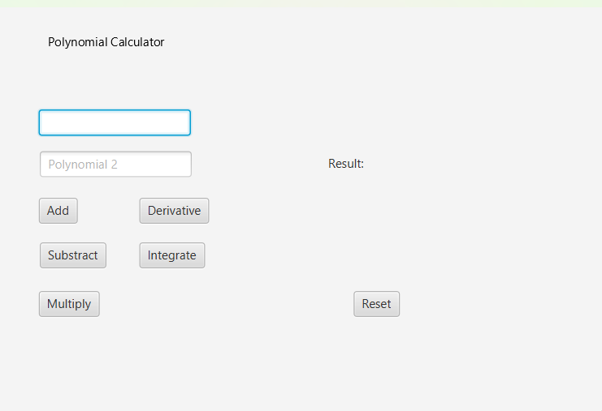
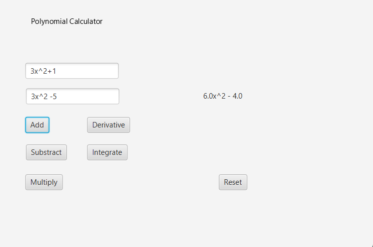

# Polynomial Calculator

This repository contains a Polynomial Calculator that allows users to perform operations like addition, subtraction, multiplication, derivatives, and integration on polynomials. Below are the use case descriptions for each operation.

## Use Case Descriptions

### 2.1 Add Polynomials
**Description**: This use case describes the scenario where the user wants to add two polynomials.

**Execution Steps**:
1. The user enters two polynomial expressions into the respective input fields.
2. The user clicks on the "Add" button.
3. The system parses the input polynomials and performs the addition operation.
4. The system displays the result of the addition in the result label.
   
### 2.2 Subtract Polynomials
**Description**: This use case describes the scenario where the user wants to subtract one polynomial from another.

**Execution Steps**:
1. The user enters two polynomial expressions into the respective input fields.
2. The user clicks on the "Subtract" button.
3. The system parses the input polynomials and performs the subtraction operation.
4. The system displays the result of the subtraction in the result label.

### 2.3 Multiply Polynomials
**Description**: This use case describes the scenario where the user wants to multiply two polynomials.

**Execution Steps**:
1. The user enters two polynomial expressions into the respective input fields.
2. The user clicks on the "Multiply" button.
3. The system parses the input polynomials and performs the multiplication operation.
4. The system displays the result of the multiplication in the result label.

### 2.4 Calculate Derivative
**Description**: This use case describes the scenario where the user wants to calculate the derivative of a polynomial.

**Execution Steps**:
1. The user enters a polynomial expression into the input field.
2. The user clicks on the "Derivative" button.
3. The system parses the input polynomial and calculates its derivative.
4. The system displays the result of the derivative in the result label.

### 2.5 Calculate Integral
**Description**: This use case describes the scenario where the user wants to calculate the indefinite integral of a polynomial.

**Execution Steps**:
1. The user enters a polynomial expression into the input field.
2. The user clicks on the "Integrate" button.
3. The system parses the input polynomial and calculates its indefinite integral.
4. The system displays the result of the integral in the result label.

### 2.6 Reset Calculator
**Description**: This use case describes the scenario where the user wants to reset the polynomial calculator.

**Execution Steps**:
1. The user clicks on the "Reset" button.
2. The system clears the input fields and the result label.
